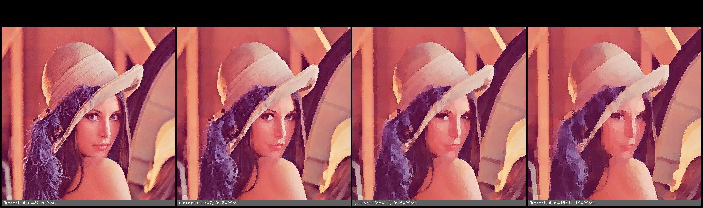

# Tycho Image Processing Library

This is a testbed for comparing and investigating difference image processsing algorithms. It is built on top of [OpenCV](https://opencv.org) and provides a simple scripting language to allow composition of different effects to produce complex results. It also has functionality to explore the parameter space of different algorithms to help get a better understanding of how the effect a range of images. It is supplied as a core library and a driver program that can be used as is to test out different algorithms and compositions.  

## Supported Platforms

The library uses C++17 functionality so a modern compiler toolchain is needed (Visual Studio 2017 or above on Windows). Clang on OSX does not currently ship with the `<filesystem>` header so you need to install another version, i.e via homebrew

```bash
brew install --with-clang llvm
```

## Cloning

OpenCV is referenced as a submodule so you need to clone with

```
git clone git@github.com:martin-slater/tycho-ipl.git --recursive
```

## Building

CMake is used to generate the specific build system for your platform.  

To generate the build system with the default cmake generator.

```bash
mkdir build
cd build
cmake ../
```

`Note: CMake will fail if you try to generate an in-tree build`

## Example Script

The following script will take an input file, clamp it to a maximum of 1024 pixels on the longest edge and then run a kuwahara filter on it and output the result.

```bash
# any variable declared as input can be modified from the command line driver
input int kernel_size = 5;

# Function parameters are passed by key=value pairs.
# __src__ and __dst__ are special parameters for the input and result images
call clamp_image_size(src = __src__, dst = __src__, size = 1024);
call kuwahara(src = __src__,  dst = __dst__, kernel_size = kernel_size);
```

Calling this from the driver program (ty_ipl_driver) like this

```bash
ty_ipl_driver.exe --contact --output_dir=./temp --experiment kernel_size=3,7,11,15 test_filter.fx image.jpg
```

Will result in the filter being run four time, once for each of the supplied kernel sizes and all the images being output to the temp directory in the following structure.

```bash
/temp
  |--/test_filter-YYYY-MM-DD-HH-MM-SS
         |---\Images
         |      |---\image.jpg
         |              |---image.jpg  
         |---test_filter-contact_sheet-YYYY-MM-DD-HH-MM-SS.jpg
```

A contact sheet will also be generated showing all of the images for easy comparison.



## Supported Functions

The full list of currently supported functions is below. Check the documention for details about parameters and examples.

| Function | Description |
|----------|-------------|
|adaptive_edge_laplacian|Find edges using a Laplacian filter. This will search the filter space for the result that contains the closest to the requested percentage of edge pixels|
|add|Component wise add two images|
|auto_level_histogram_clip|Auto levels image lighting based on the image histogram.|
|auto_level_histogram_clip|Auto levels image lighting based on the image histogram.|
|auto_level_opencv|Auto levels image lighting using OpenCV's built in algorithm|
|auto_level_rgb_stretch|Auto levels image lighting by stretching each RGB channel to use the full range [0,255].|
|bilateral|Apply bilateral filter to the image. This maintains edges and softens flat regions.|
|bitwise_and|Component wise bitwise and two images|
|bitwise_or|Component wise bitwise or two images|
|bitwise_xor|Component wise and two images|
|blend_add|Photoshop add blend function.|
|blend_average|Photoshop average blend function.|
|blend_color_burn|Photoshop color_burn blend function.|
|blend_color_dodge|Photoshop color_dodge blend function.|
|blend_darken|Photoshop darken blend function.|
|blend_difference|Photoshop difference blend function.|
|blend_exclusion|Photoshop exclusion blend function.|
|blend_glow|Photoshop glow blend function.|
|blend_hard_light|Photoshop hard_light blend function.|
|blend_hard_max|Photoshop hard_mix blend function.|
|blend_lighten|Photoshop lighten blend function.|
|blend_linear_burn|Photoshop linear_burn blend function.|
|blend_linear_dodge|Photoshop linear_dodge blend function.|
|blend_linear_light|Photoshop linear_light blend function.|
|blend_multiply|Photoshop multiply blend function.|
|blend_negation|Photoshop negation blend function.|
|blend_normal|Photoshop normal blend function.|
|blend_overlay|Photoshop overlay blend function.|
|blend_phoenix|Photoshop phoenix blend function.|
|blend_pin_light|Photoshop pin_light blend function.|
|blend_reflect|Photoshop reflect blend function.|
|blend_screen|Photoshop screen blend function.|
|blend_soft_light|Photoshop soft_light blend function.|
|blend_sub|Photoshop subtract blend function.|
|blend_vivid_lights|Photoshop vivid_light blend function.|
|clamp_image_size|Clamp an image to a given size whilst maintaining its aspect ratio|
|color_reduce_kmeans|Reduces the number of colors in the image to a specified number.|
|color_reduce_libimagequant|Reduces the number of colors in the image to a specified number.|
|color_reduce_median_cut|Reduces the number of colors in the image to a specified number.|
|convert_image|Convert an image to a different format|
|copy|Copy an image|
|denoise|Remove noise from the passed image.|
|dilate|dilate the image.|
|divide|Component wise divide two images|
|edge_canny|Canny edge detection filter|
|edge_laplacian|Find edges using laplacian filter|
|edge_sobel|Find edges using Sobel filter|
|erode|erode the image.|
|experiment_add_image|Add an image to the list of images created by this run of an experiment|
|gamma_correct|Apply gamma correct to an image|
|gaussian_blur|Blur the image using a gaussian filter|
|greyscale|Convert colour image to greyscale.|
|image_adjust|Adjust the contrast and brightness of an image|
|kuwahara|Apply the kuwahara operator. This smooths textured regions whilst maintaining edges.|
|load_image|Load an image to disk|
|max|max|
|min|min|
|mulitply|Component wise multiply two images|
|oil_painting|Transform the image to have an oil painted appearance|
|remove_intensity|Removes the intensity from the image. If the image is in a colour space that contains an intensity channel (Lab, HLS, HSV) then this will be cleared. If the image is in RGB space then each texel is normalized as sum = R + G + B, R' = R / sum, G' = G / sum, B' = B / sum. If sum is less than black-cutoff then it is clamped to zero.|
|rescale|Proportionally resize an image|
|resize|Resize an image|
|save_image|Write image to disk|
|scaled_add|Compute src1 * scale + src2|
|scaled_multiple|Component wise multiply two images|
|sepia_yiq|Sepia tone effect calculated in YIQ space. Results in a deeper brown colour than sepia_rgb.|
|sepia_rgb|Sepia tone effect calculated in RGB space. Results in a less brown image than sepia_yiq.|
|sepia_yiq|Sepia tone effect calculated in YIQ space. Results in a deeper brown colour than sepia_rgb.|
|simplify_colors|Simply the colors used in the image|
|subtract|Component wise subtract two images|
|threshold|Remove noise from the passed image.|
|visualize_palette|Create a visualization of the colours used in the image|

## License

MIT License - See LICENSE.txt for details

Copyright (c) 2018 Martin Slater (mslater@hellinc.net)