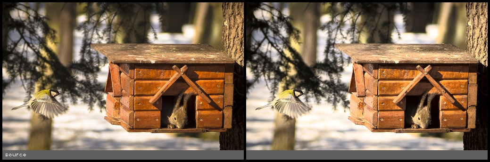

auto_level_opencv(src)
======================

Auto levels image lighting using OpenCV's built in algorithm

**Inputs**

.. csv-table::
   :header: "name", "type", "default", "description"
   :widths: 20,10,10,60

   "**src**", "*image*", "", "Source image"

**Outputs**

.. csv-table::
   :header: "name", "type", "default", "description"
   :widths: 20,10,10,60

   "**dst**", "*image*", "", "Destination image"

