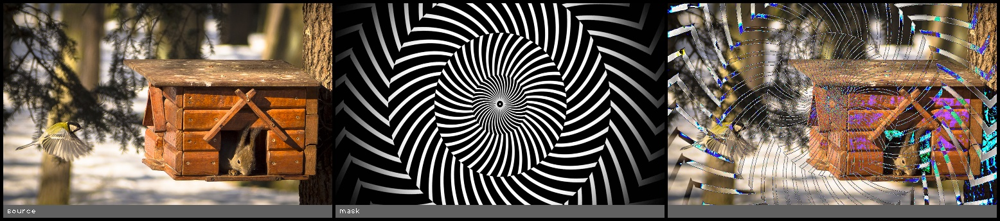

blend_linear_light(src1, src2)
==============================

Photoshop linear_light blend function.

**Inputs**

.. csv-table::
   :header: "name", "type", "default", "description"
   :widths: 20,10,10,60

   "**src1**", "*image*", "", "First source image"
   "**src2**", "*image*", "", "Second source image"

**Outputs**

.. csv-table::
   :header: "name", "type", "default", "description"
   :widths: 20,10,10,60

   "**dst**", "*image*", "", "Destination image"

