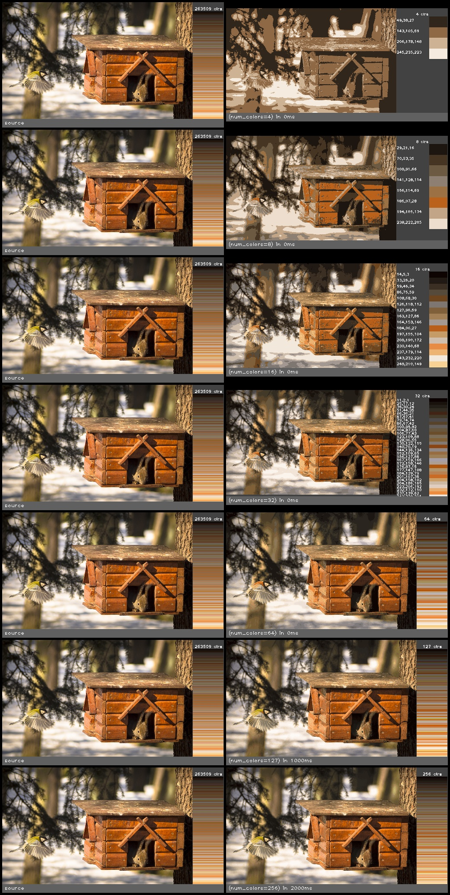

color_reduce_kmeans(src, num_colors, num_attempts, term_epsilon, term_iterations)
=================================================================================

Reduces the number of colors in the image to a specified number.

**Inputs**

.. csv-table::
   :header: "name", "type", "default", "description"
   :widths: 20,10,10,60

   "**src**", "*image*", "", "Source image"
   "**num_colors**", "*int*", "256", "Number of colors to reduce the image to. Must be greater than 0"
   "**num_attempts**", "*int*", "1", "Number of iterations to search for a result"
   "**term_epsilon**", "*int*", "50", "Termination epsilon"
   "**term_iterations**", "*int*", "4", "Number of iterations to search for a result"

**Outputs**

.. csv-table::
   :header: "name", "type", "default", "description"
   :widths: 20,10,10,60

   "**dst**", "*image*", "", "Destination image"

