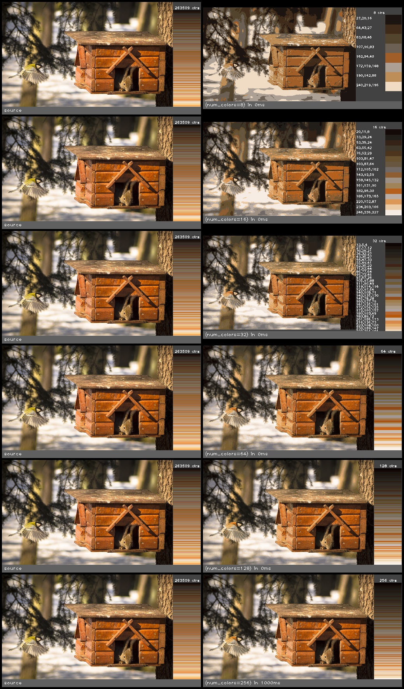

color_reduce_median_cut(src, num_colors)
========================================

Reduces the number of colors in the image to a specified number.

**Inputs**

.. csv-table::
   :header: "name", "type", "default", "description"
   :widths: 20,10,10,60

   "**src**", "*image*", "", "Source image"
   "**num_colors**", "*int*", "256", "Number of colors to reduce the image to. This must be a power of 2 (2, 4, 8, 16, etc)."

**Outputs**

.. csv-table::
   :header: "name", "type", "default", "description"
   :widths: 20,10,10,60

   "**dst**", "*image*", "", "Destination image"

