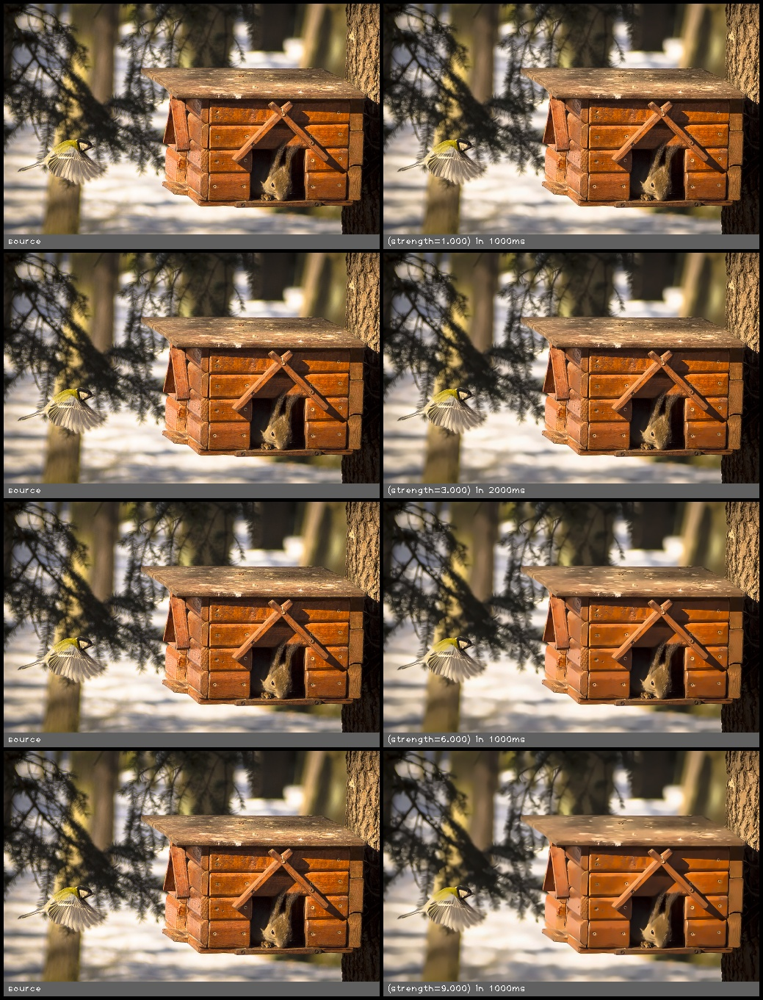

denoise(src, strength)
======================

Remove noise from the passed image.

**Inputs**

.. csv-table::
   :header: "name", "type", "default", "description"
   :widths: 20,10,10,60

   "**src**", "*image*", "", "Source image"
   "**strength**", "*float*", "3.000", "higher removes more noise but will remove more features"

**Outputs**

.. csv-table::
   :header: "name", "type", "default", "description"
   :widths: 20,10,10,60

   "**dst**", "*image*", "", "Destination image"

