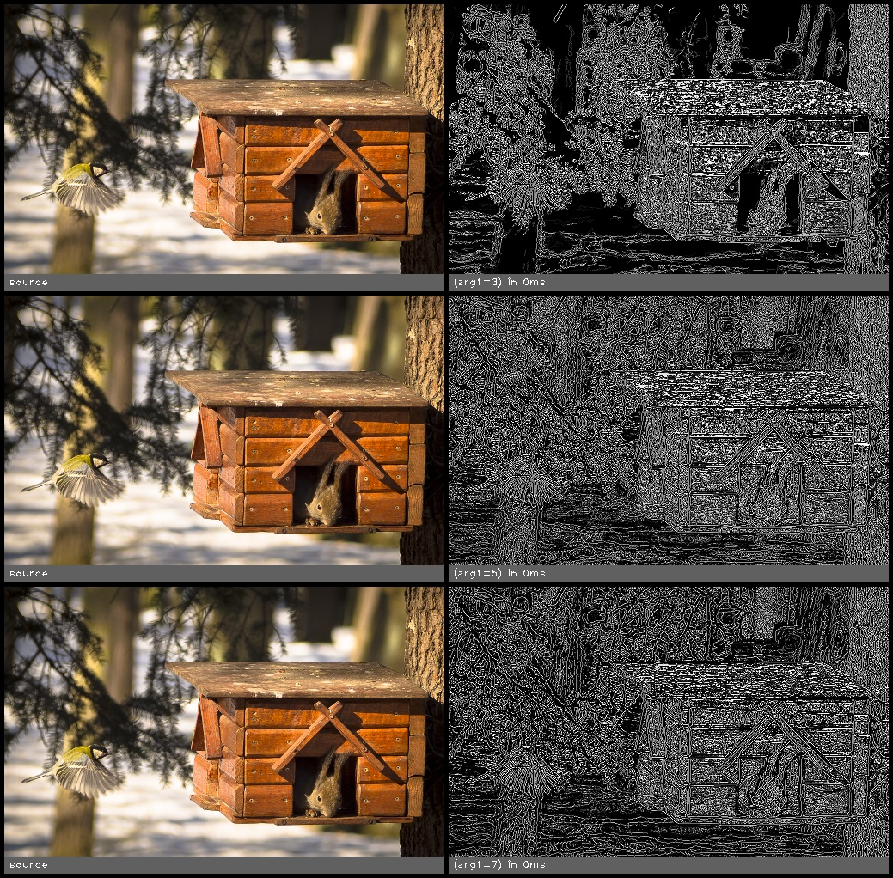

edge_canny(src, kernel_size, threshold_low, threshold_high, invert)
===================================================================

Canny edge detection filter

**Inputs**

.. csv-table::
   :header: "name", "type", "default", "description"
   :widths: 20,10,10,60

   "**src**", "*image*", "", "Source image"
   "**kernel_size**", "*int*", "3", "Kernel size for the sobel operator"
   "**threshold_low**", "*float*", "25.000", "First threshold for the hysteresis procedure"
   "**threshold_high**", "*float*", "50.000", "Second threshold for the hysteresis procedure"
   "**invert**", "*bool*", "false", "Invert the results"

**Outputs**

.. csv-table::
   :header: "name", "type", "default", "description"
   :widths: 20,10,10,60

   "**dst**", "*image*", "", "Destination image"

