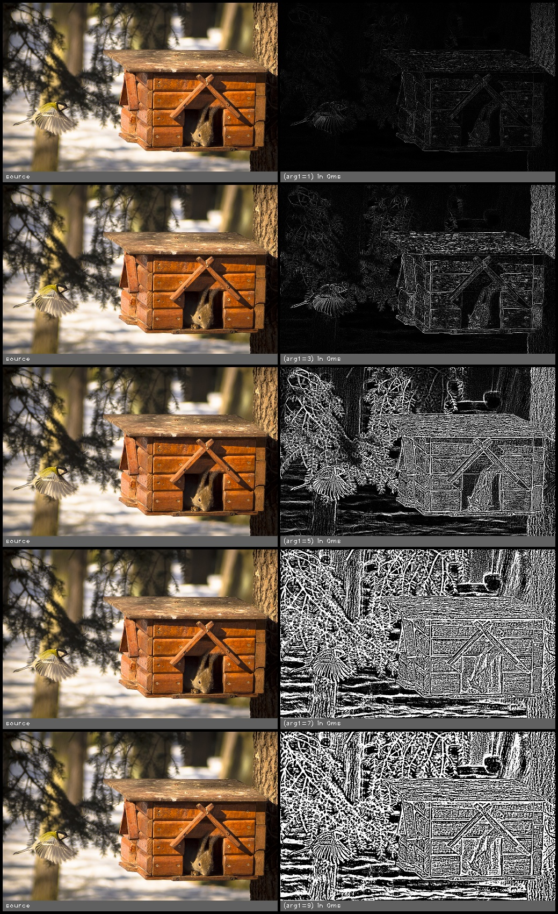

edge_laplacian(src, kernel_size, invert)
========================================

Find edges using laplacian filter

**Inputs**

.. csv-table::
   :header: "name", "type", "default", "description"
   :widths: 20,10,10,60

   "**src**", "*image*", "", "Source image"
   "**kernel_size**", "*int*", "3", "Higher increases sensitivity. Must be an odd value."
   "**invert**", "*bool*", "false", "Invert the results"

**Outputs**

.. csv-table::
   :header: "name", "type", "default", "description"
   :widths: 20,10,10,60

   "**dst**", "*image*", "", "Destination image"

