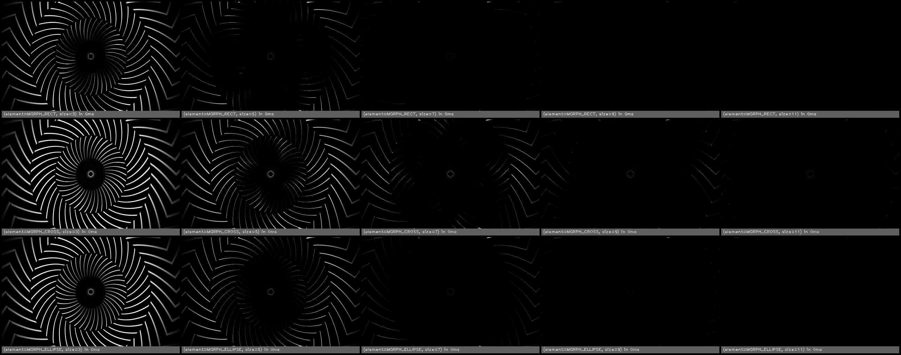

erode(src, size, element)
=========================

erode the image.

**Inputs**

.. csv-table::
   :header: "name", "type", "default", "description"
   :widths: 20,10,10,60

   "**src**", "*image*", "", "Source image"
   "**size**", "*int*", "3", ""
   "**element**", "*int*", "2", "Structuring element. One of MORPH_RECT, MORPH_CROSS, MORPH_ELLIPSE."

**Outputs**

.. csv-table::
   :header: "name", "type", "default", "description"
   :widths: 20,10,10,60

   "**dst**", "*image*", "", "Destination image"

