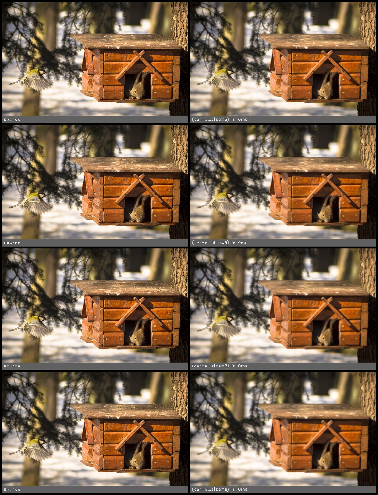

gaussian_blur(src, kernel_size, sigma_x, sigma_y)
=================================================

Blur the image using a gaussian filter

**Inputs**

.. csv-table::
   :header: "name", "type", "default", "description"
   :widths: 20,10,10,60

   "**src**", "*image*", "", "Source image"
   "**kernel_size**", "*int*", "3", "Size of the kernel"
   "**sigma_x**", "*float*", "0.000", "Gaussian kernel standard deviation in X direction"
   "**sigma_y**", "*float*", "0.000", "Gaussian kernel standard deviation in Y direction"

**Outputs**

.. csv-table::
   :header: "name", "type", "default", "description"
   :widths: 20,10,10,60

   "**dst**", "*image*", "", "Destination image"

