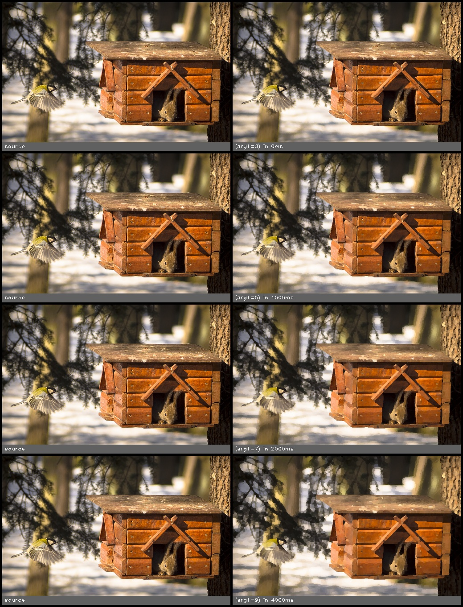

kuwahara(src, kernel_size)
==========================

Apply the kuwahara operator. This smooths textured regions whilst maintaining edges.

**Inputs**

.. csv-table::
   :header: "name", "type", "default", "description"
   :widths: 20,10,10,60

   "**src**", "*image*", "", "Source image"
   "**kernel_size**", "*int*", "5", "Radius around each pixel to examine"

**Outputs**

.. csv-table::
   :header: "name", "type", "default", "description"
   :widths: 20,10,10,60

   "**dst**", "*image*", "", "Destination image"

