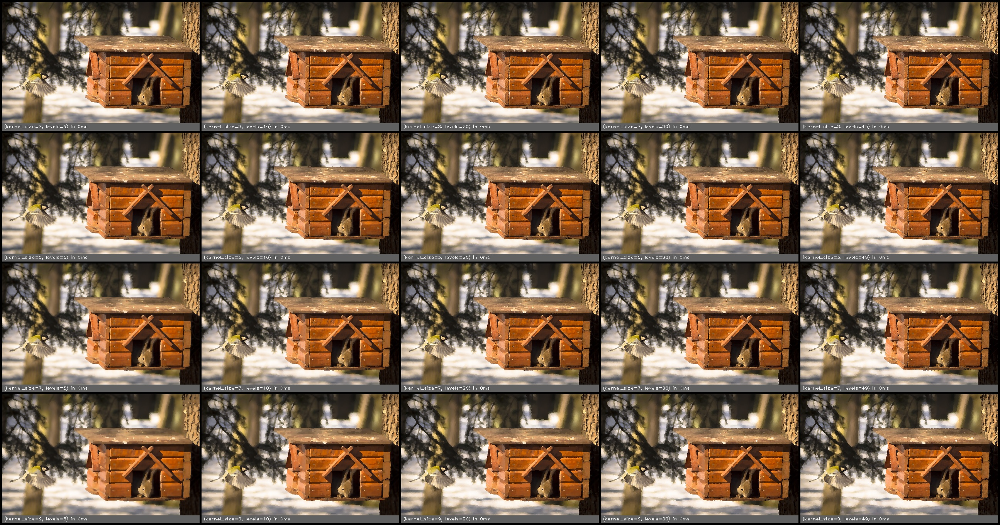

oil_painting(src, kernel_size, levels)
======================================

Transform the image to have an oil painted appearance

**Inputs**

.. csv-table::
   :header: "name", "type", "default", "description"
   :widths: 20,10,10,60

   "**src**", "*image*", "", "Source image"
   "**kernel_size**", "*int*", "5", "Radius around each pixel to examine"
   "**levels**", "*int*", "20", "Number of intensity levels"

**Outputs**

.. csv-table::
   :header: "name", "type", "default", "description"
   :widths: 20,10,10,60

   "**dst**", "*image*", "", "Destination image"

